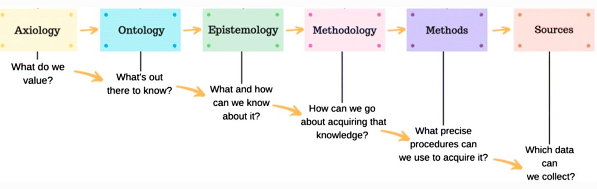

### Topic 2: Philosophical Foundations of Research

#### Three Foundational Questions

A professor of mine often observed that a fundamental attribute of being human is to ask questions. Humanity is especially interested in three fundamental questions: What is real? What is true? What is good? The philosophical category of metaphysics is concerned with what is real, and what is the nature of reality. The philosophical category of epistemology is concerned with what is true, and what is the nature and process of knowing. The philosophical category of axiology is concerned with what is good and how we can determine the nature of goodness. Much of history is a chronicle of the different ways people have answered these three fundamental questions. How we answer these questions reveals our perspective, or our worldview.

Every person bases his or her own thoughts, decisions, and actions on what is called a worldview. A worldview is "an interpretive framework through which one makes sense of themselves, other people, and the world around them" (Geisler & Watkins, 2003). It is like a pair of glasses that you wear when you are observing things about yourself, other people and the world in which you live.  Here is a short video by the Impact 360 Institute (2014) that explains "What's your worldview?"

[plugin:youtube](https://youtu.be/VXnSE0uvwzM)

A discussion about worldview, or your perspective, is foundational to what we want to accomplish in this course. Throughout this course I will ask these questions: On what basis are sound decisions made?  What evidence do leaders rely upon for best outcomes when they are making decisions?  Each of us has a preference for obtaining truth or a framework for understanding ourselves, others, and the world, and personal preferences abound.  Researchers and consumers of research (i.e. us) approach knowledge and learning and life with a certain perspective and it is important to understand that perspective before you jump into the research journey and it is certainly something to consider in positions of leadership.

 (Image Source: https://link.springer.com/article/10.1007/s40670-019-00898-9)

Here is a really helpful video by Laura Killam (2013) that explains Paradigms, Ontology and Epistemology.

[plugin:youtube](https://youtu.be/hCOsY5rkRs8)

It is important to be aware of your worldview before you enter into the research journey because it will inform the types of questions that you ask as well as the processes that you use to find the answers to your questions. As an example, let me explain a Christian worldview and explore how this worldview can be applied to the research journey.

A Christian worldview asserts that God has created the world and everything in it, and that truth is arrived at through a study of God's specific revelation (the Bible) and general revelation (creation). Christians believe not only in studying and understanding truth, but they also believe in a personal God that has revealed Himself through this created world.

The Christian worldview can be summarized in three words: Creation, Fall and Redemption. Let me unpack these terms. Initially, when God created the world, it was all good and whole and harmonious. God created man in His own image. Originally man was created healthy in body, soul and spirit (Genesis 1:26-27, 31). As people rebelled against God, causing the Fall, the presence of sin corrupted all aspects of God's good creation, and brought about much suffering. Where there was formerly harmony and wholeness, we now experience ourselves, our relationships and the world around us as fractured, broken and full of dis-ease (a literal discomfort with who we are) (Genesis 3).

Despite the brokenness, Christians believe that God is actively working to bring about restoration and wholeness to His entire creation. Through Christ’s redemptive work on the cross, people are reconciled to God and are challenged to make all things as they were created and meant to be – very good. Redemption means that all things are made new in Christ (Colossians 1:19-20).

The framework of Creation, Fall and Redemption is important because it allows us to enter into a discussion about research with confidence knowing that God’s redemptive work touches this area. Christians believe that we are called to study creation with the desire to take the knowledge we gain and use it to help and bless others; to work toward the restoration and healing of God’s creation. Christians are called to inquire, to investigate, to ask questions, always with a view to serve others.

It is beyond the purpose of this course to go deeper into this topic other than to make the point that our way of knowing and understanding the world around us (i.e., our worldview) influences how we approach all of life, including how we approach research and how we use research to inform our decision-making process.  
[plugin:content-inject](../_1-2)
